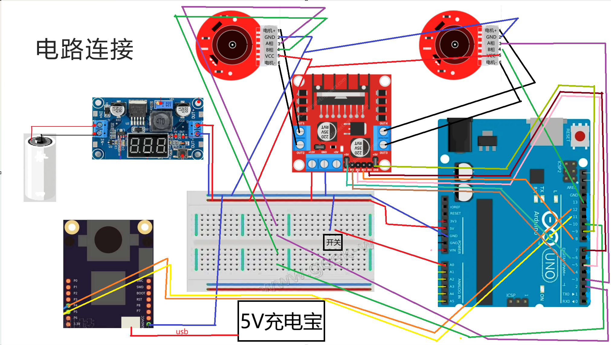

# OpenMV-Arduino-PID-Smart-Car

## 项目简介

本项目为 **基于 OpenMV 视觉模块与 Arduino 控制平台的智能小车系统**，设计并实现了一种结合 **视觉感知 + 霍尔编码器测速 + PID 控制算法** 的闭环控制方案。小车能够在给定赛道环境下完成 **自主循迹、稳定转弯与速度控制**，并满足竞赛对尺寸、速度与稳定性的综合要求。

该项目来源于 **某校智能小车设计竞赛**，重点训练了嵌入式系统集成能力、传感器融合思路以及控制算法的工程化实现。

---

## 设计目标与约束

* 小车垂直投影始终位于赛道区域内，避免压线
* 在保证稳定性的前提下尽可能提高运行速度
* 减小左右电机性能差异，保持直行与转弯一致性
* 车体尺寸满足：长 ≤ 30 cm，宽 ≤ 20 cm，高 ≤ 25 cm

---

## 系统总体方案

系统采用 **“视觉感知 + 控制决策 + 执行反馈”** 的经典闭环结构：

* **OpenMV**：负责赛道黑线识别与偏差计算
* **Arduino UNO**：负责控制逻辑与 PID 运算
* **霍尔编码器**：实时测速，提供速度反馈
* **电机驱动模块**：执行转速控制

视觉模块与控制模块通过串口通信协同工作，整体控制周期约为 **50 ms**。

---

## 硬件组成

| 模块   | 型号 / 说明                        |
| ---- | ------------------------------ |
| 主控板  | Arduino UNO                    |
| 视觉模块 | OpenMV H7 Plus                 |
| 电机驱动 | L298N                          |
| 电机   | TT 电机                          |
| 测速模块 | 霍尔编码器                          |
| 降压模块 | LM2596S（DC-DC）                 |
| 电源   | 7.4V 锂电池 + 5V 充电宝（OpenMV 独立供电） |

## 硬件连接说明

系统硬件连接关系如下图所示：

- OpenMV 通过串口与 Arduino 通信  
- 霍尔编码器分别接入 Arduino 中断引脚用于测速  
- Arduino 通过 L298N 驱动模块控制左右电机转速  
- OpenMV 采用独立 5V 供电，避免电机负载导致电压不稳

**设计说明：**

* OpenMV 具备较大视野，适合赛道黑线检测
* 霍尔编码器用于获取实际速度，支撑 PID 闭环控制
* OpenMV 独立供电，避免因电流过大导致电压不稳

---

## 核心运行逻辑

1. OpenMV 在指定 ROI 区域内提取赛道黑色边界
2. 计算两条边界的中点，得到与画面中心的偏移量
3. 根据偏移量生成转向信号并发送至 Arduino
4. Arduino 接收信号，计算目标速度
5. 通过霍尔编码器获取实际速度
6. 使用 **PID 算法** 计算控制量，调节电机转速
7. 循环执行上述过程，实现稳定循迹

---

## 控制算法说明（PID）

* 控制目标：使电机实际转速 (v) 跟踪期望转速 (w)
* 误差定义：(error = w - v)
* PID 控制器根据误差计算输出电压控制量

通过实验调试发现：

* 合理增大 **Ki** 参数可有效消除稳态误差
* PID 参数对转弯平滑性与直行稳定性影响显著

---

## 程序结构说明

### Arduino 端

* 定时统计霍尔编码器脉冲数（50 ms）
* 解析来自 OpenMV 的转向信号
* 计算期望速度并执行 PID 运算
* 输出 PWM 信号驱动电机

### OpenMV 端

* 连续采集图像并提取黑色赛道边界
* 计算中点并判定转向幅度
* 通过软串口向 Arduino 发送控制信号
* 保持与 Arduino 一致的通信频率

---

## 调试与问题解决

* **通信问题**：改用软串口，避免调试受限
* **供电异常**：OpenMV 独立供电，解决电压下降与过热问题
* **测速异常**：避免调试 LED 与霍尔编码器引脚冲突
* **视觉误判**：通过调整黑色阈值，避免阴影干扰

---

## 项目收获

* 掌握 OpenMV 视觉处理与 Arduino 协同开发流程
* 理解 PID 控制算法在实际系统中的调参与应用
* 提升嵌入式系统调试与问题定位能力
* 完成从方案设计到实物调试的完整工程闭环

---

## 关键词

`OpenMV` `Arduino` `PID Control` `Vision-Based Robot` `Smart Car`

